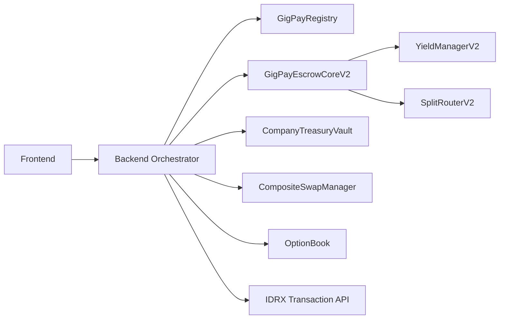

# GigPay Backend & Agent Architecture

GigPay is designed to be operated by **agents**, not humans clicking buttons.

---

## What the Backend Does

The backend is NOT a custodian.

It is:
- an orchestrator
- a policy engine
- an automation layer

---

## Core Responsibilities

### 1) Indexing

Listen to events:
- IntentCreated
- Funded
- Submitted
- Released
- Refunded
- ProtectionBought
- ProtectionSettled
- ProtectionClaimed

Build:
- dashboards
- audit logs
- timelines

---

### 2) RFQ & Routing

- Fetch RFQ quotes from:
  - Thetanuts
  - Other RFQ sources (future)
- Choose best route
- Call:
  - buyProtectionFromQuote(...)
  - releaseWithSwap(...)

---

### 3) Automation Agents

Using Base AgentKit:

Agents can:
- Auto-fund intents from treasury
- Auto-release after acceptance window
- Auto-refund after deadline
- Auto-settle and claim protection
- Auto-rebalance treasury

---

### 4) Policy Engine

Offchain rules like:

- If amount > X → require 2 approvals
- If vendor is new → force protection
- If acceptance > 7 days → enable escrow yield
- If FX pair is volatile → require hedge

---

### 5) Webhooks & Integrations

- ERP systems
- Marketplaces
- Payroll systems
- Accounting software

---

## Architecture


# GigPay Protocol - Backend Integration Guide (V2 Fullstack)

This guide defines the backend responsibilities for GigPay V2. It aligns the
backend with the on-chain flow and the frontend integration guide while adding
deep coverage for IDRX fiat rails, Thetanuts RFQ protection, and swap execution.

---

## 1) Purpose and audience

Build from this guide if your backend orchestrates:
- `GigPayEscrowCoreV2` intent lifecycle and settlement
- `CompanyTreasuryVault` funding, yield ops, and refunds
- Thetanuts OptionBook RFQ protection and RFQ swap execution
- IDRX Transaction API mint, redeem, and bridge flows

The backend is the reliability layer: it indexes events, enforces state
transitions, generates `swapData`, and coordinates off-chain payment rails.

---

## 2) System components (registry-resolved)

Resolve all modules through `GigPayRegistry` per chain:
- `GigPayEscrowCoreV2` for intents, release/refund, protection, and swaps
- `CompanyTreasuryVault` for funding and treasury yield
- `YieldManagerV2` for escrow and treasury yield routing
- `SplitRouterV2` for principal distribution
- `TokenRegistry` for escrow-eligible assets
- `SwapRouteRegistry` for RFQ and fallback policy per pair
- `CompositeSwapManager` for RFQ primary + optional fallback
- `OptionBook` for Thetanuts protection and RFQ fills
- `ThetanutsVaultStrategyV2` for ERC4626 vault routing (mock or real)

Reference deployments in `documentation/DEPLOYMENT.md`.

### Orchestration overview


---

## 3) Backend responsibilities

### 3.1 Event indexing and state tracking
Index events to maintain a canonical `intentId` state:
- `IntentCreated`, `Funded`, `Submitted`, `Released`, `Refunded`
- `EscrowYieldOn` (shares recorded)
- `ProtectionBought`, `ProtectionAttached`, `ProtectionSettled`, `ProtectionClaimed`
- `SwapAttempted`, `SwapExecuted`, `SwapSkipped`

Use events for low-latency updates, but always confirm by reading
`GigPayEscrowCoreV2.intents(intentId)`.

### 3.2 State machine enforcement and idempotency
Act on on-chain status, not tx hashes:
- `Created` -> `Funded` -> `Submitted` -> `Released` or `Refunded`
- `refundToTreasury` requires deadline passed (if set)
- `releaseWithSwap` requires `asset != payoutAsset`

Make retries idempotent by checking `status`, `swapRequired`, and policy status.

### 3.3 Treasury operations
Typical backend-driven treasury actions:
- Fund: `CompanyTreasuryVault.fundEscrow(escrow, asset, intentId, amount)`
- Release (no swap): `GigPayEscrowCoreV2.release(intentId)`
- Release (swap): `GigPayEscrowCoreV2.releaseWithSwap(intentId, swapData)`
- Refund: `GigPayEscrowCoreV2.refundToTreasury(intentId)`

Pre-flight checks:
- `TokenRegistry.isEscrowEligible` for asset and payoutAsset
- Treasury balance and approvals
- Split totals sum to 10,000 bps

### 3.4 Yield orchestration
Escrow yield activates automatically on `submitWork` if:
- `escrowYieldEnabled = true`
- `acceptanceWindow > 24 hours`

No backend call required. Index `EscrowYieldOn` and track `escrowShares`.

Mock vault integration:
- Ensure `YieldManagerV2.setStrategy(strategyId, strategyAddr, true)` is set to
  `ThetanutsVaultStrategyV2` before enabling yield on intents.
- For Base Sepolia demos, use `MockThetanutsVault` as the ERC4626 target vault.

### 3.5 Swap routing and `swapData`
If `asset != payoutAsset`, backend must construct `swapData`:
- `OptionBookRFQSwapManager`: `abi.encode(order, signature)`
- `CompositeSwapManager`: `abi.encode(primaryData, fallbackData, allowFallback)`

Use `SwapRouteRegistry` to decide RFQ-only vs allow fallback. When RFQ is not
available, submit a fallback swap only if the route policy allows it.
Each `(assetIn, payoutAsset)` pair must be configured in `SwapRouteRegistry`
before you expose that payout option in the frontend.
For multiple payout assets (e.g., IDRX -> USDC/DAI/EURC/USDT), set one route per
pair and cache them for route validation.

### 3.6 Protection orchestration
Backend coordinates policy purchase and claims:
- `buyProtectionFromQuote(intentId, quote, buyer)` from treasury
- `attachExistingPolicy(intentId, policyId, buyer)` for off-chain policies
- `settleAndClaimProtection(intentId)` to move payout into escrow

Protection payout is treated as "extra" on release/refund.

---

## 4) On-chain data model (from contracts)

### 4.1 Intent fields
From `GigPayEscrowCoreV2.Intent`:
- `treasury`, `payer`, `creator`
- `asset`, `payoutAsset`, `amount`, `deadline`, `acceptanceWindow`
- `status`, `swapRequired`, `preferredRoute`
- `escrowYieldEnabled`, `escrowStrategyId`, `escrowShares`, `submittedAt`
- `protectionEnabled`, `protectionPolicyId`, `protectionBuyer`, `protectionBoughtAt`

### 4.2 Split fields
From `GigPayEscrowCoreV2.Split`:
- `recipient`, `bps` (sum must equal 10,000)

---

## 5) Recommended data model (backend)

### 5.1 Intent table
- `intentId`, `treasury`, `payer`, `creator`
- `asset`, `payoutAsset`, `amount`, `deadline`, `acceptanceWindow`
- `status`, `swapRequired`, `preferredRoute`
- `escrowYieldEnabled`, `escrowStrategyId`, `escrowShares`, `submittedAt`

### 5.2 Split table
- `intentId`, `recipient`, `bps`

### 5.3 Protection table
- `intentId`, `policyId`, `buyer`, `premium`, `payout`, `expiry`
- `protectionEnabled`, `protectionBuyer`, `protectionBoughtAt`
- `settled`, `claimed`

### 5.4 Swap table
- `intentId`, `venue`, `amountIn`, `amountOut`
- `swapTxHash`, `swapStatus`

### 5.5 Transaction table
- `intentId`, `action`, `txHash`, `timestamp`, `chainId`

---

## 6) Fullstack flow (frontend, backend, on-chain)

### 6.1 Create intent (frontend)
```
GigPayEscrowCoreV2.createIntentFromTreasury(...)
```
or with payout asset:
```
GigPayEscrowCoreV2.createIntentFromTreasuryWithPayout(...)
```

Backend tasks:
- Index `IntentCreated` and store intent + splits
- Validate `TokenRegistry` eligibility for asset and payoutAsset

### 6.2 Fund escrow (backend/treasury)
```
CompanyTreasuryVault.fundEscrow(escrow, asset, intentId, amount)
```

Backend tasks:
- Check vault balance, approvals, and intent status
- Index `Funded` and update `payer`

### 6.3 Submit work (frontend)
```
GigPayEscrowCoreV2.submitWork(intentId, evidenceHash)
```

Backend tasks:
- Index `Submitted` and `submittedAt`
- If yield activates, index `EscrowYieldOn` and track shares

### 6.4 Protection flow (backend)
```
GigPayEscrowCoreV2.buyProtectionFromQuote(intentId, quote, buyer)
GigPayEscrowCoreV2.settleAndClaimProtection(intentId)
```

Backend tasks:
- Ensure buyer approved premium to OptionBook
- Track `policyId`, `ProtectionBought`, `ProtectionSettled`, `ProtectionClaimed`
- Treat protection payout as extra balance for release/refund

### 6.5 Release or refund (backend/treasury)
Release (no swap):
```
GigPayEscrowCoreV2.release(intentId)
```

Release (swap):
```
GigPayEscrowCoreV2.releaseWithSwap(intentId, swapData)
```

Refund:
```
GigPayEscrowCoreV2.refundToTreasury(intentId)
```

Backend tasks:
- Gate by `status`, `swapRequired`, and `deadline`
- Build `swapData` when required
- Index `Released` or `Refunded` and record payouts
- When swap is required, validate route policy from `SwapRouteRegistry`

---

## 7) Thetanuts integration (on-chain)

### 7.1 Protection quote and policy
On-chain quote struct:
```
IThetanutsOptionBook.Quote {
  asset,
  premium,
  payout,
  expiry,
  maker,
  rfqId
}
```

Protection flow:
1. Backend obtains off-chain RFQ quote payload (TBD, see Section 7.3).
2. Call `buyProtectionFromQuote(intentId, quote, buyer)` from treasury.
3. OptionBook attaches the policy to the intent.
4. Call `settleAndClaimProtection(intentId)` to move payout into escrow.

### 7.2 RFQ swap execution (OptionBook)
RFQ order struct:
```
IOptionBookRFQ.Order {
  maker,
  orderExpiryTimestamp,
  collateral,
  isCall,
  priceFeed,
  implementation,
  isLong,
  maxCollateralUsable,
  strikes[],
  expiry,
  price,
  numContracts,
  extraOptionData
}
```

Swap data encoding:
- `OptionBookRFQSwapManager`: `abi.encode(order, signature)`
- `CompositeSwapManager`: `abi.encode(primaryData, fallbackData, allowFallback)`
Fallback data encoding:
- `FallbackSwapManager`: `abi.encode(target, callData)`

### 7.3 Off-chain RFQ payload (TBD)
The Thetanuts off-chain RFQ payload and signature format is not documented
publicly yet. Keep quote and order generation in the backend and serialize
directly into the on-chain structs above.

### 7.4 Mock vault yield routing (Base Sepolia)
For hackathon demos without official Thetanuts vaults on Base Sepolia:
1. Deploy `MockThetanutsVault` with Base Sepolia IDRX as `asset()`.
2. Deploy `ThetanutsVaultStrategyV2` pointing to the mock vault.
3. Register the strategy in `YieldManagerV2` and use that `strategyId` in intents.
4. Optional: simulate yield by calling `MockThetanutsVault.donate()`.

---

## 8) Base Sepolia Mock Wiring Checklist

Use this when deploying the mock RFQ stack on Base Sepolia:
- Deploy `MockOptionBook`, `OptionBookRFQSwapManager`, `FallbackSwapManager`, and a new `CompositeSwapManager`.
- Update `GigPayRegistry` modules:
  - `OPTION_BOOK` -> MockOptionBook
  - `RFQ_MANAGER` -> OptionBookRFQSwapManager
  - `SWAP_MANAGER` -> new CompositeSwapManager
- Configure `SwapRouteRegistry` for each payout pair:
  - `IDRX -> USDC`, `IDRX -> DAI`, `IDRX -> EURC`, `IDRX -> USDT`
- Build swap data with:
  - primary: `abi.encode(order, signature)`
  - composite: `abi.encode(primaryData, fallbackData, allowFallback)`
  - fallback: `abi.encode(target, callData)`

---

## 9) DeployRfqMockWire Script Deep Notes

This section documents the assumptions and integration details for
`script/DeployRfqMockWire.s.sol`.

### 9.1 On-chain preconditions (required)
The script will revert unless:
- The deployer is the `owner` of `GigPayRegistry` and `SwapRouteRegistry`.
- `abis/gigpay.base-sepolia.abis.json` includes addresses for:
  - `GigPayRegistry`
  - `GigPayEscrowCoreV2`
  - `SwapRouteRegistry`
  - `MockIDRX`, `MockUSDC`, `MockDAI`, `MockEURC`, `MockUSDT`
- The route registry accepts each configured `(assetIn, payoutAsset)` pair.

### 9.2 What the script does
- Deploys RFQ mock stack:
  - `MockOptionBook`
  - `OptionBookRFQSwapManager`
  - `FallbackSwapManager`
  - New `CompositeSwapManager` wired to the existing escrow address
- Updates registry modules:
  - `OPTION_BOOK`, `RFQ_MANAGER`, `SWAP_MANAGER`
- Sets multiple routes for the same `assetIn`:
  - IDRX -> USDC/DAI/EURC/USDT
- Supports per-token RFQ/fallback flags (see env vars below).

### 9.3 Environment variables
Core:
- `PRIVATE_KEY`
- `RFQ_REFERRER` (optional; defaults to deployer)

Route selection:
- `ROUTE_ASSET_IN` (defaults to `MockIDRX`)
- `ROUTE_RFQ_ALLOWED` (default `1`)
- `ROUTE_FALLBACK_ALLOWED` (default `0`)
- `ROUTE_RFQ_VENUE` (defaults to `MockOptionBook`)
- `ROUTE_FALLBACK_VENUE` (defaults to `FallbackSwapManager`)

Per-token route toggles:
- `ROUTE_ENABLE_USDC`, `ROUTE_ENABLE_DAI`, `ROUTE_ENABLE_EURC`, `ROUTE_ENABLE_USDT`

Per-token RFQ/fallback flags:
- `ROUTE_RFQ_ALLOWED_USDC`, `ROUTE_FALLBACK_ALLOWED_USDC`
- `ROUTE_RFQ_ALLOWED_DAI`, `ROUTE_FALLBACK_ALLOWED_DAI`
- `ROUTE_RFQ_ALLOWED_EURC`, `ROUTE_FALLBACK_ALLOWED_EURC`
- `ROUTE_RFQ_ALLOWED_USDT`, `ROUTE_FALLBACK_ALLOWED_USDT`

Example `.env` snippet (Base Sepolia, RFQ primary with USDT fallback):
```
PRIVATE_KEY=0x...
RFQ_REFERRER=0x0000000000000000000000000000000000000000

ROUTE_ASSET_IN=0x20Abd5644f1f77155c63A8818C75540F770ae223  # MockIDRX
ROUTE_RFQ_VENUE=0x0000000000000000000000000000000000000000  # MockOptionBook
ROUTE_FALLBACK_VENUE=0x0000000000000000000000000000000000000000  # FallbackSwapManager
ROUTE_ENABLE_USDC=1
ROUTE_ENABLE_DAI=1
ROUTE_ENABLE_EURC=1
ROUTE_ENABLE_USDT=1

ROUTE_RFQ_ALLOWED_DAI=1
ROUTE_FALLBACK_ALLOWED_DAI=0

ROUTE_RFQ_ALLOWED_USDT=1
ROUTE_FALLBACK_ALLOWED_USDT=1
```

### 9.4 Swap data encoding (backend must match)
Backend must match the on-chain encoding exactly:
- Composite swap:
```
swapData = abi.encode(primaryData, fallbackData, allowFallback)
```
- RFQ primary:
```
primaryData = abi.encode(order, signature)
```
- Fallback:
```
fallbackData = abi.encode(target, callData)
```

### 9.5 Post-deploy verification checklist
- Read `GigPayRegistry` and confirm:
  - `OPTION_BOOK` matches MockOptionBook
  - `RFQ_MANAGER` matches OptionBookRFQSwapManager
  - `SWAP_MANAGER` matches the new CompositeSwapManager
- Read `SwapRouteRegistry.getRoute(assetIn, payoutAsset)` for each payout token
- Confirm backend is using the registry-resolved swap manager address

---

## 8) IDRX integration (deep, from official docs)

Official docs: https://docs.idrx.co/api/transaction-api

### 8.1 Authentication headers
Every request includes:
- `idrx-api-key`
- `idrx-api-sig`
- `idrx-api-ts`

`idrx-api-sig` is an HMAC-SHA256 signature over method + URL + timestamp + body
using a base64-decoded secret key, then encoded as base64url:
https://docs.idrx.co/api/generating-a-signature

### 8.2 Mint request (fiat -> on-chain)
Endpoint:
```
POST /api/transaction/mint-request
```

Required fields (docs):
- `toBeMinted` (string)
- `destinationWalletAddress` (string)
- `networkChainId` (string)
- `expiryPeriod` (number)
- `requestType` (string, optional: empty or "idrx"; "usdt" for other tokens)

Optional fields:
- `productDetails` (string, overrides payment page note)
- `customerDetail` (object: `firstName`, `lastName`, `email`)

Constraints (docs):
- Minimum: 20,000 IDR for IDRX, $2 USD for other stablecoins
- Maximum: 1,000,000,000 IDR for IDRX, $5,555 USD for other stablecoins
- Processing to `destinationWalletAddress` within 24 hours
- Requests are canceled if payment is not completed within 24 hours

Example payload shape:
```
{
  "toBeMinted": "string",
  "destinationWalletAddress": "string",
  "expiryPeriod": 0,
  "networkChainId": "string",
  "requestType": "string",
  "productDetails": "string",
  "customerDetail": {
    "firstName": "string",
    "lastName": "string",
    "email": "string"
  }
}
```

Example response shape (success):
```
{
  "statusCode": 200,
  "message": "success",
  "data": {
    "id": "85",
    "merchantCode": "DS15079",
    "reference": "DS1507923DW1N5088J6LW6TO",
    "paymentUrl": "https://app-sandbox.duitku.com/redirect_checkout?reference=...",
    "amount": "19500.00",
    "statusCode": "00",
    "statusMessage": "SUCCESS",
    "merchantOrderId": "20230321091546"
  }
}
```

Backend flow:
1. Validate KYC, limits, and destination wallet.
2. Submit mint request, persist `id`, `reference`, `paymentUrl`.
3. Track status via `GET /api/transaction/user-transaction-history`.
4. Confirm on-chain receipt before funding treasury or escrow.

### 8.3 Redeem request (on-chain -> fiat)
Endpoint:
```
POST /api/transaction/redeem-request
```

Required fields (docs):
- `txHash` (burn transaction hash)
- `networkChainId`
- `amountTransfer`
- `bankAccount`
- `bankCode` (use `GET /api/transaction/method`)
- `bankName`
- `bankAccountName`
- `walletAddress`
- `notes` (required if bank account owner differs)

Example payload shape:
```
{
  "txHash": "string",
  "networkChainId": "string",
  "amountTransfer": "string",
  "bankAccount": "string",
  "bankCode": "string",
  "bankName": "string",
  "bankAccountName": "string",
  "walletAddress": "string",
  "notes": "string"
}
```

Example response shape (success):
```
{
  "statusCode": 200,
  "message": "success",
  "data": {
    "id": 14,
    "chainId": 80001,
    "userId": 3,
    "requester": "Test Account",
    "txHash": "0xd946...",
    "amount": "100000",
    "bankName": "BANK CENTRAL ASIA",
    "bankCode": "014",
    "bankAccountNumber": "8760673566",
    "bankAccountName": "Test Account",
    "burnStatus": "REQUESTED"
  }
}
```

Processing notes (docs):
- Payout to `bankAccount` within 24 hours
- Validate bank details and handle mismatched account names explicitly
- Track status via `GET /api/transaction/user-transaction-history`

### 8.4 Bridge request (cross-chain)
Endpoint:
```
POST /api/transaction/bridge-request
```

Required fields (docs):
- `txHashBurn` (burn tx hash)
- `bridgeToChainId`
- `bridgeFromChainId`
- `amount`
- `bridgeNonce` (from burn event)
- `destinationWalletAddress`

Example payload shape:
```
{
  "txHashBurn": "string",
  "bridgeToChainId": 0,
  "bridgeFromChainId": 0,
  "amount": "string",
  "bridgeNonce": "string",
  "destinationWalletAddress": "string"
}
```

Example response shape (success):
```
{
  "statusCode": 201,
  "message": "success",
  "data": {
    "id": 3,
    "bridgeFromChainId": 80001,
    "bridgeToChainId": 97,
    "txHashBurn": "0x38ef...",
    "txHashMint": null,
    "bridgeNonce": "0",
    "amount": "100000",
    "bridgeStatus": "REQUESTED"
  }
}
```

Backend flow:
- Validate chain ids and IDRX supported networks
- Track status via `GET /api/transaction/user-transaction-history` before funding escrow

### 8.5 Additional endpoints (docs)
- `GET /api/transaction/method` (bank codes)
- `GET /api/transaction/user-transaction-history` (status tracking)
- `GET /api/transaction/rates` (pricing)
- `GET /api/transaction/get-additional-fees` (fees)

### 8.6 Error handling and retries
- Treat each IDRX request as an async job with an idempotency key
- Retry only when status indicates no processing
- Alert on mismatched on-chain balances or stalled requests

---

## 9) Operational playbook

### 9.1 Key management
- Use a dedicated treasury operator key or multisig
- Rotate and rate-limit API keys used for IDRX

### 9.2 Governance checks
- Validate assets with `TokenRegistry`
- Validate routes with `SwapRouteRegistry` before swaps
- Ensure `OptionBook` has payout liquidity for RFQ swaps and protection

### 9.3 Safety checks
- Verify split sums = 10,000 bps
- Ensure treasury balance before fund and release
- Gate actions by `Status` and deadline

---

## 10) Test mapping (validation)

Use the on-chain tests as flow references:
- Basic release/refund: `Flow.TreasuryToEscrow.*`
- Escrow yield: `Flow.LongAcceptanceWindow.*`
- Protection: `Flow.Protection.*`
- Swap RFQ/fallback: `GigPayEscrowCoreV2.RFQRelease.t.sol`, `Flow.Swap.Fallback.Release.t.sol`
- Combined flows: `Flow.Combo.YieldPlusProtection.*`

---

## 11) Minimal backend loop (reference)

1. Index `IntentCreated` and persist intent + splits.
2. Treasury funds after approvals and checks.
3. Index `Submitted`; monitor yield activation.
4. If protection enabled, buy and attach policy, then settle and claim.
5. If swap required, build `swapData`.
6. Release or refund based on business logic and deadlines.
