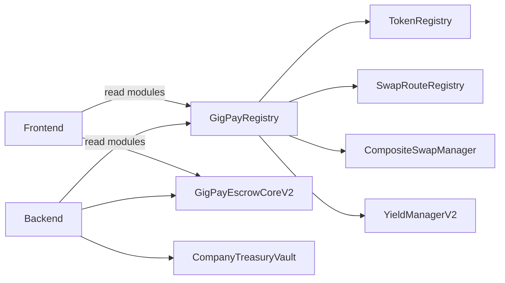

# GigPay ABI Docs Index (Base Sepolia)

## 1. Purpose
This index documents how to discover and integrate GigPay contracts deployed on Base Sepolia. It is the entry point for frontend and backend integrations that use the ABIs in `abis/` and the deployment map in `abis/gigpay.base-sepolia.abis.json`.

---

## 2. Deployment Map (Base Sepolia)
Source: `abis/gigpay.base-sepolia.abis.json`

| Contract | Address | Explorer |
| --- | --- | --- |
| `GigPayRegistry` | `0x32F8dF36b1e373A9E4C6b733386509D4da535a72` | https://base-sepolia.blockscout.com/address/0x32F8dF36b1e373A9E4C6b733386509D4da535a72 |
| `CompanyTreasuryVault` | `0xcDfd5B882e8dF41b3EFc1897dAf759a10a7457B8` | https://base-sepolia.blockscout.com/address/0xcDfd5B882e8dF41b3EFc1897dAf759a10a7457B8 |
| `GigPayEscrowCoreV2` | `0xd09177C97978f5c970ad25294681F5A51685c214` | https://base-sepolia.blockscout.com/address/0xd09177C97978f5c970ad25294681F5A51685c214 |
| `TokenRegistry` | `0x3Ded1e4958315Dbfa44ffE38B763De5b17690C57` | https://base-sepolia.blockscout.com/address/0x3Ded1e4958315Dbfa44ffE38B763De5b17690C57 |
| `SwapRouteRegistry` | `0xa85D9Cf90E1b8614DEEc04A955a486D5E43c3297` | https://base-sepolia.blockscout.com/address/0xa85D9Cf90E1b8614DEEc04A955a486D5E43c3297 |
| `CompositeSwapManager` | `0x2b7ca209bca4E0e15140857dc6F13ca17B50F50d` | https://base-sepolia.blockscout.com/address/0x2b7ca209bca4E0e15140857dc6F13ca17B50F50d |
| `MockOptionBook` | `TBD` |  |
| `OptionBookRFQSwapManager` | `TBD` |  |
| `FallbackSwapManager` | `TBD` |  |
| `YieldManagerV2` | `0x22c94123e60fA65D742a5872a45733154834E4b0` | https://base-sepolia.blockscout.com/address/0x22c94123e60fA65D742a5872a45733154834E4b0 |
| `GigPayFaucet` | `0x31d563850441a218F742237aF505fb7Fc4198bc7` | https://base-sepolia.blockscout.com/address/0x31d563850441a218F742237aF505fb7Fc4198bc7 |
| `MockUSDC` | `0x44E7c97Ee6EC2B25145Acf350DBBf636615e198d` | https://base-sepolia.blockscout.com/address/0x44E7c97Ee6EC2B25145Acf350DBBf636615e198d |
| `MockUSDT` | `0xDbb4DEfa899F25Fd1727D55cfb66F6EB0C378893` | https://base-sepolia.blockscout.com/address/0xDbb4DEfa899F25Fd1727D55cfb66F6EB0C378893 |
| `MockDAI` | `0x029a0241F596B9728c201a58CD9aa9Db5d3ac533` | https://base-sepolia.blockscout.com/address/0x029a0241F596B9728c201a58CD9aa9Db5d3ac533 |
| `MockEURC` | `0xE9b7236DF6610C1A694955fFe13ca65970183961` | https://base-sepolia.blockscout.com/address/0xE9b7236DF6610C1A694955fFe13ca65970183961 |
| `MockIDRX` | `0x20Abd5644f1f77155c63A8818C75540F770ae223` | https://base-sepolia.blockscout.com/address/0x20Abd5644f1f77155c63A8818C75540F770ae223 |

---

## 3. Address Discovery Pattern
### 3.1 Frontend
- Use `GigPayRegistry` read functions (`tokenRegistry()`, `routeRegistry()`, `swapManager()`, `yieldManager()`) to resolve module addresses at runtime.
- Use `TokenRegistry` to validate token eligibility and fetch decimals/symbols.
- Cache resolved addresses in app state; refresh if a `ModuleSet` event is observed.

### 3.2 Backend
- Treat `GigPayRegistry` as the source of truth for module addresses.
- Index `ModuleSet` events and refresh your module-address cache when modules change.
- Resolve route and token eligibility via `SwapRouteRegistry` and `TokenRegistry` before constructing transactions.

---

## 4. Integration Flow (High Level)

---

## 5. Contract Interactions
### 5.1 Core Flow
- `GigPayEscrowCoreV2` creates intents, holds escrowed funds, and orchestrates release/refund.
- `CompanyTreasuryVault` funds intents and receives refunds, and can move treasury funds into `YieldManagerV2`.
- `TokenRegistry` is the allowlist and metadata source for tokens used by escrow and swaps.
- `SwapRouteRegistry` defines which asset pairs can be swapped and which venue(s) are valid.
- `CompositeSwapManager` executes the actual swap using the preferred venue and data.

### 5.2 Yield Flow
- Escrow and treasury deposits call into `YieldManagerV2`, which records shares and allows withdrawals back to escrow or treasury.
- Escrow events (`EscrowYieldOn`, `Released`, `Refunded`) drive when yield positions are created or unwound.

### 5.3 Protection Flow
- Escrow can attach or buy protection and later settle claims. The swap manager and route registry remain independent.

---

## 6. Typical Lifecycle Flow (Detailed)
1. **Resolve modules** via `GigPayRegistry` to get the latest addresses.
2. **Validate assets** using `TokenRegistry` and, if swapping, `SwapRouteRegistry`.
3. **Create intent** in `GigPayEscrowCoreV2` using `createIntentFromTreasury` or `createIntentFromTreasuryWithPayout`.
4. **Fund intent** by calling `CompanyTreasuryVault.fundEscrow`.
5. **Submit work** with `GigPayEscrowCoreV2.submitWork`.
6. **Release or swap-release**:
   - `release` for same-asset payouts
   - `releaseWithSwap` for different payout asset, using `CompositeSwapManager`
7. **Refund** if the deadline passes or work is rejected.
8. **Yield** (optional): escrow/treasury funds are deposited to and withdrawn from `YieldManagerV2`.

---

## 7. Related Contract Docs
- `documentation/abiDocs/GigPayRegistry.md`
- `documentation/abiDocs/GigPayEscrowCoreV2.md`
- `documentation/abiDocs/CompanyTreasuryVault.md`
- `documentation/abiDocs/TokenRegistry.md`
- `documentation/abiDocs/SwapRouteRegistry.md`
- `documentation/abiDocs/CompositeSwapManager.md`
- `documentation/abiDocs/YieldManagerV2.md`
- `documentation/abiDocs/GigPayFaucet.md`
- `documentation/abiDocs/MockUSDC.md`, `documentation/abiDocs/MockUSDT.md`, `documentation/abiDocs/MockDAI.md`, `documentation/abiDocs/MockEURC.md`, `documentation/abiDocs/MockIDRX.md`
